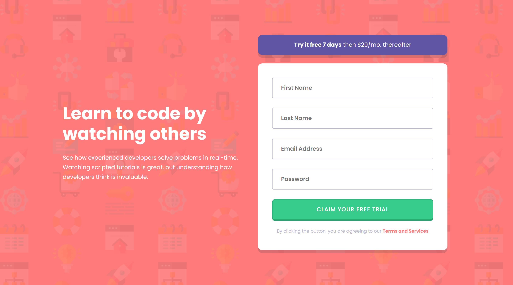
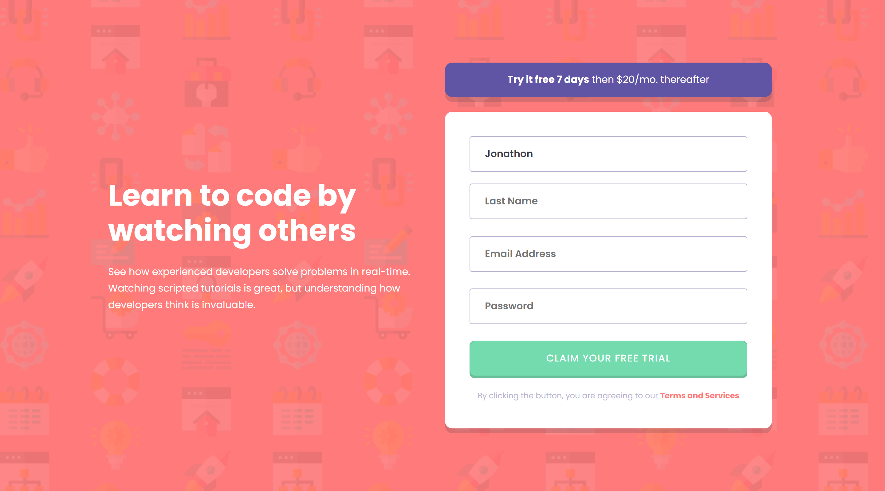

# Frontend Mentor - Intro component with sign up form solution

This is a solution to the [Intro component with sign up form challenge on Frontend Mentor](https://www.frontendmentor.io/challenges/intro-component-with-signup-form-5cf91bd49edda32581d28fd1). Frontend Mentor challenges help you improve your coding skills by building realistic projects. 

## Table of contents

- [Overview](#overview)
  - [The challenge](#the-challenge)
  - [Screenshot](#screenshot)
  - [Links](#links)
- [My process](#my-process)
  - [Built with](#built-with)
  - [What I learned](#what-i-learned)
  - [Continued development](#continued-development)
  - [Useful resources](#useful-resources)
- [Author](#author)

## Overview

This is the third challenge in the **JavaScript Fundamentals Frontend Mentor Roadmap**. it consists of an Intro Page with a signup form.

The challenge aims to use JavaScript to validate if the form fields are not empty and the email is a valid one.

### The challenge

Users should be able to:

- View the optimal layout for the site depending on their device's screen size
- See hover states for all interactive elements on the page
- Receive an error message when the `form` is submitted if:
  - Any `input` field is empty. The message for this error should say *"[Field Name] cannot be empty"*
  - The email address is not formatted correctly (i.e. a correct email address should have this structure: `name@host.tld`). The message for this error should say *"Looks like this is not an email"*

### Screenshot

#### Mobile

##### Initial View

##### Interactive States View

##### Error View

#### Desktop

##### Initial View

##### Interactive States View

##### Error View

### Links

- Solution URL: [Solution URL](https://www.frontendmentor.io/solutions/intro-component-with-signup-form-6FMsBMrigt)
- Live Site URL: [Live Site URL](https://frontendmentor-ilyesab.github.io/intro-component-with-signup-form/)

## My process

### Built with

- Semantic HTML5 markup
- CSS custom properties
- CSS Grid
- Mobile-first workflow
- Vanilla JS
- Constraint Validation API

### What I learned

I used the **Constraint Validation API** to complete the challenge of implementing the form validation.

when the form is submitted. we call the `form.checkValidity()` which returns if the controls within the form are all valid (if this is the case we submit the form) and if not trigger invalid events on the invalid elements.

we listen for the invalid events and also change events on the input. which calls a function that show the error based on why the input is invalid or remove the error indicators/classes if the input is valid.

### Continued development

It was very fun practicing form validation. as this is quite the topic and forms are everywhere on the web.

I'm curious on how libraries handle form validation and if it's better to use a library for it than the native constraint validation API.

### Useful resources

- [MDN: Client Side Validation Article](https://developer.mozilla.org/en-US/docs/Learn/Forms/Form_validation) - This Article from MDN was my main source to work on the challenge. it covers the different native ways to deal with client side from validation.

## Author

- Frontend Mentor - [@ilyesab](https://www.frontendmentor.io/profile/ilyesab)
